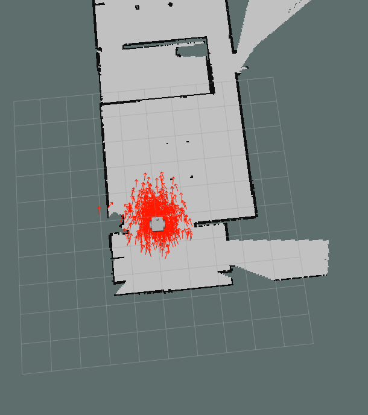
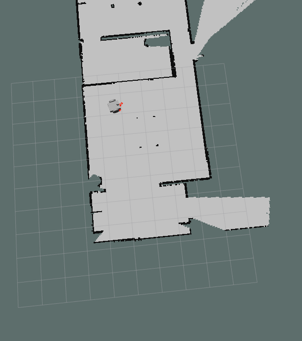

# SLAM-Robot
This Robot does the simple task of traversing a known map after localizing itself in it. 

The Robot is Called Moodz After my Room-mate. 
Moodz (the robot) was designed in Fusion360 and the moodz_description pkg was generated by the fusion2urdf tool.

Localizing The Robot in the Environment

Bird Eye's View of localized Robot

Path to Goal Location

Reaching Goal Location:

Problems Faced: 

Trying to Traverse Closed off locations due to faulty map

Another Problem was that the robot would be "lost" when rotating; this with fixed upon tuning the odom_alpha AMCL parameters.
